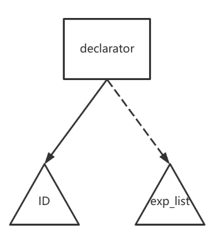

# MIDL

> Mini Interface Description Language。
>
> 实现MIDL的词法分析和语法分析。
>
> 使用c++17标准，引用的第三方库[json.hpp](https://github.com/nlohmann/json)

## 词法分析

* 16个关键字，不区分大小写

  | `struct` | `float`  | `boolean` | `short`    |
  | -------- | -------- | --------- | ---------- |
  | `long`   | `double` | `int8`    | `int16`    |
  | `int32`  | `int64`  | `uint8`   | `uint16`   |
  | `uint32` | `uint64` | `char`    | `unsigned` |

* 17个专用符号

  | `{`  | `}`  | `;`  | `[`  | `]`  |
  | :--: | :--: | :--: | :--: | :--: |
  | `*`  | `+`  | `-`  | `~`  | `/`  |
  | `%`  | `>>` | `<<` | `&`  | `^`  |
  | `\|` | `,`  |      |      |      |

* 4种类型

  * `ID = LETTER (UNDERLINE?(LETTER | DIGIT))*` 其中`LETTER = [a-z] | [A- Z]`、`DIGIT = [0-9]`、`UNDERLINE= _`
  * `INTEGER  = (0 | [1-9] [0-9]*) INTEGER_TYPE_SUFFIX?` 其中`INTEGER_TYPE_SUFFIX =  l | L`
  * `STRING = "(ESCAPE_SEQUENCE | (~\ | ~"))*" ` 其中 `ESCAPE_SEQUENCE =  \ (b | t | n | f | r | " | \ )`
  * `BOOLEAN = TRUE | FALSE`

  > *表示闭包，?表示0/1个，`~\`表示\除外的字符，()表示优先级

* DFA分析

  

  * 上述DFA将16个关键字和BOOlEAN类型识别为ID，这不是BUG，而是为了统一DFA的事件处理，简化DFA模型。可以在一个ID识别完成时，判断它是不是关键字或BOOLEAN类型。
  
  * 上述DFA只画出了识别一个Token时的状态转换。实际编写程序时，为了尽可能识别出所有错误，考虑到了token识别错误时从错误中恢复(具体见程序)。
  
  * 写程序时，考虑到方便处理并没有将Integer的识别分为InINT1和InINT2两个状态，而是统一按InINT1的状态处理，如果检测到Token的值以0开头且不为0、0l、0L时，当出错处理。
  

## 语法分析

* 抽象语法树设计

  * struct_type

  

  * member_list

  

  * type_spec、base_type_spec、floating_pt_type、integer_type、signed_int、unsigned_int

    成员类型都为终结符，可统一处理，均视为type_spec，对于由多个部分(至多三个)组成的类型，多出的部分放到右兄弟结点

  

  * declarators

  

  * declarator

  

  * exp_list

  

  * or_expr、xor_expr、and_expr、shift_expr、add_expr、mult_expr

  

  ​		对于以上几个表达式采用以上语法树描述，按照从左到右的结合性，越靠左越处于语法树的底层。

  * unary_expr

  

  ​		左孩子是可选的三个运算符，右孩子是STRING、INTEGER、BOOLEAN三种类型的数据。

* 抽象语法树的输出：采用json格式输出，left代表左子树，right代表右子树，next代表右兄弟结点

